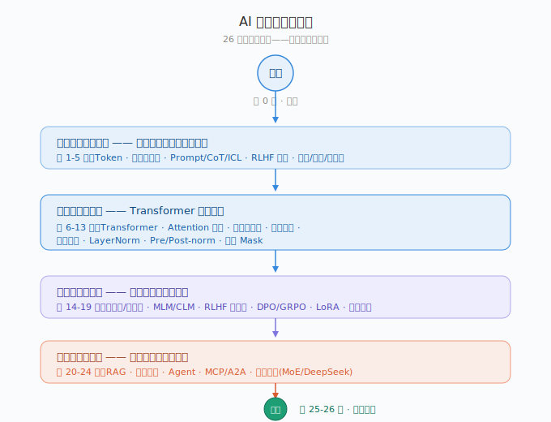

# 第 0 课：开篇，这本书怎么读 + 大模型五分钟全景图

三个月前我准备 AI 技术面，背了一沓面试八股，背到第三天就崩溃了。不是因为记不住。是面试官每个词都能追着问，LoRA 原理？跟 QLoRA 的区别？为什么不用 Adapter？

后来我发现，大模型里那些让人头大的概念，每个都对应一个生活里的比喻。Attention 是图书馆查资料。残差连接是传话游戏的复印件。LayerNorm 是把全班身高统一成标准尺。

这本书就是把这些比喻整理了出来。26 课，分五部分。

**第一部分，世界观（1-5 课）**：Token、预训练、微调，涌现和幻觉，Prompt 工程，RLHF，量化蒸馏分布式。

**第二部分，引擎（6-13 课）**：Transformer 架构，Attention 公式，多头注意力，位置编码，残差，归一化，Pre/Post-norm，两种 Mask。面试里被问得最多的八课。

**第三部分，炼金（14-19 课）**：参数 vs 数据，MLM vs CLM，RLHF 全流程，DPO/GRPO，LoRA，训练硬核。

**第四部分，落地（20-24 课）**：RAG，推理优化，Agent，MCP 协议，前沿架构。

**第五部分，实战（25-26 课）**：十道大厂真题 + 系统设计。

零基础顺着读。面试突击跳到 25-26 课刷真题。有基础的跳着当词典查。

---

## 思考题

1. 目录里挑一个你最感兴趣的概念，用一句话说清楚它大概是什么。不需要精确，用你自己的话。

2. 为什么技术圈喜欢用 RoPE、MoE、SwiGLU 这些缩写轰炸而不是说人话？

---

> 磨平一些信息差。
