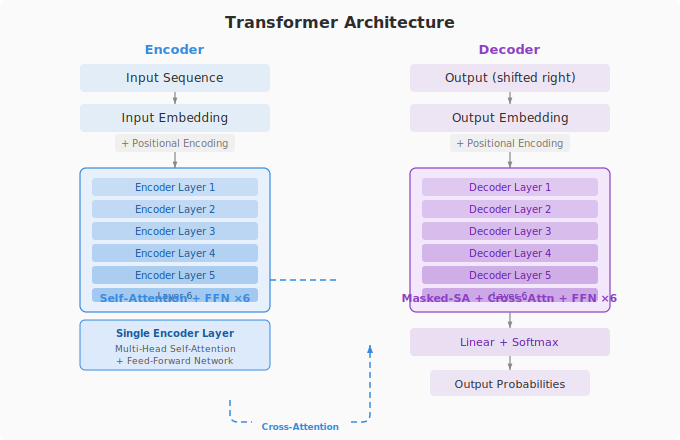

# 第 6 课：Transformer 到底是什么

2017 年 Google 发了篇论文，《Attention Is All You Need》。没吹牛。GPT、Claude、Llama、DeepSeek 全是它的直系后代。

RNN 像只有一个收费窗口，车必须排队过。Transformer 像几十个窗口同时开，所有车一起处理，每辆车能同时看到路上所有其他车。

原版 Transformer 有 Encoder 和 Decoder。Encoder 双向理解输入，Decoder 单向生成输出。Enc-Dec 之间有 Cross-Attention 传信息。

后来大家发现可以只用一半。扔掉 Encoder，只用 Decoder，这就是 GPT。扔掉 Decoder，只用 Encoder，这就是 BERT。两边都留着，这就是 T5。

共享的砖块只有四种。注意力机制，每个词跟所有其他词对话。残差连接，梯度高速公路。层归一化，统一数值范围。位置编码，注入词序信息。

Transformer 不是模型，是一套建筑图纸。用这套图纸你可以盖 BERT、GPT 或 T5。GPT-4 堆了几百层，但砖还是这四种。

---

## 追问模块

**追问：「Transformer 比 RNN 最大优势？」** 并行计算。训练速度快几十到上百倍。

**追问：「原版 6 层怎么定的？」** 实验调的。在 WMT 翻译任务上性价比最高。

**追问：「GPT 只用 Decoder 怎么理解 Prompt？」** 自注意力。Decoder 不能看未来但能看过去，你的 Prompt 就是过去。

---

## 思考题

1. 给一个不懂技术的朋友解释 Transformer。不许用「神经网络」「注意力」这些词。

2. GPT、BERT、T5，分别适合什么场景。

---

> 磨平一些信息差。
