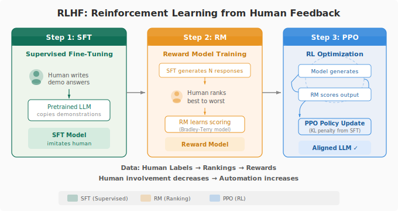

# 第 16 课：RLHF 全流程，SFT → RM → PPO

SFT：人类写几千条「完美回答」，模型用交叉熵损失学着模仿。学完能从「会说话」变成「会说及格的话」。

RM：训练一个打分模型。同一个 prompt 多个回答，人排序（A>B>C>D），不是打分，排序是稳定的，打分主观。RM 学会输出标量奖励 r，r 越高回答越好。

PPO：策略模型生成回答，RM 打分，根据分数调参数。核心机制：Clip，新旧策略概率比超范围就截断，防单步更新过大。KL 散度约束，不让新策略偏离原始 SFT 模型太远，防 Reward Hacking（模型学会糊弄 RM 拿高分但回答质量崩了）。

四个模型同时维护：策略模型、参考模型（冻结的 SFT）、奖励模型、价值模型。这就是 RLHF 成本高的根本原因。

---

## 追问模块

**追问：「RM 为什么排序而非打分？」** 打分尺度因人而异，有人全给 9 分有人全给 5 分。排序全人类一致。

**追问：「PPO 能不能用现成模型替代 RM？」** 能，但专用 RM 更懂你的模型可能出什么错。

---

## 思考题

1. 你生活中有没有 Reward Hacking，为了好评价刻意讨好标准而非改进自己。

2. RM 把「越长越好」当标准，PPO 后的模型会怎样。怎么修复。

---

> 磨平一些信息差。
