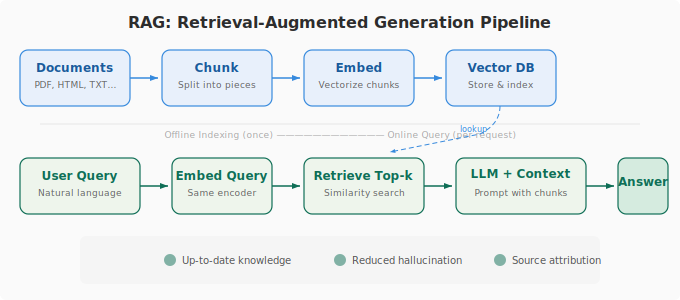

# 第 20 课：RAG，让模型会查资料

大模型会编造不存在的 API、不存在的书名、不存在的历史事件。幻觉。

RAG 不给模型凭记忆回答。给它一本参考书，让它翻完再说。

五步。切分：文档切成 200-500 Token 小块。块太大检索不准，太小上下文不够。建索引：每块用 embedding 模型转向量，存进向量数据库。查询：用户问题转向量，检索最接近的 Top-K 块。混合检索：向量检索 + BM25 关键词检索，拼起来重排序，语义相近和精确匹配兼顾。生成：拼成 Prompt「根据以下资料回答。资料：[检索结果]。问题：[用户问题]」发给大模型。

RAG 不是银弹。检索可能不准，模型可能忽略检索结果继续编。但它至少给了模型正确答案的参考，比纯记忆回答已经是质的飞跃。

---

## 追问模块

**追问：「Chunk size 怎么定？」** 从 300 开始，根据任务粒度调。问答偏小，摘要偏大。

**追问：「向量检索和关键词检索死穴？」** 向量检索同义词不准。关键词检索数字/型号不准。混合用最实用。

**追问：「RAG 怎么评估？」** RAGAS 框架：检索质量、生成质量、端到端质量三个维度。

---

## 思考题

1. 给你们公司内部文档设计一个 RAG 系统。文档库有什么类型，每步怎么选。

2. RAG 能彻底解决幻觉吗。三层防线的幻觉防御体系怎么设计。

---

> 磨平一些信息差。
